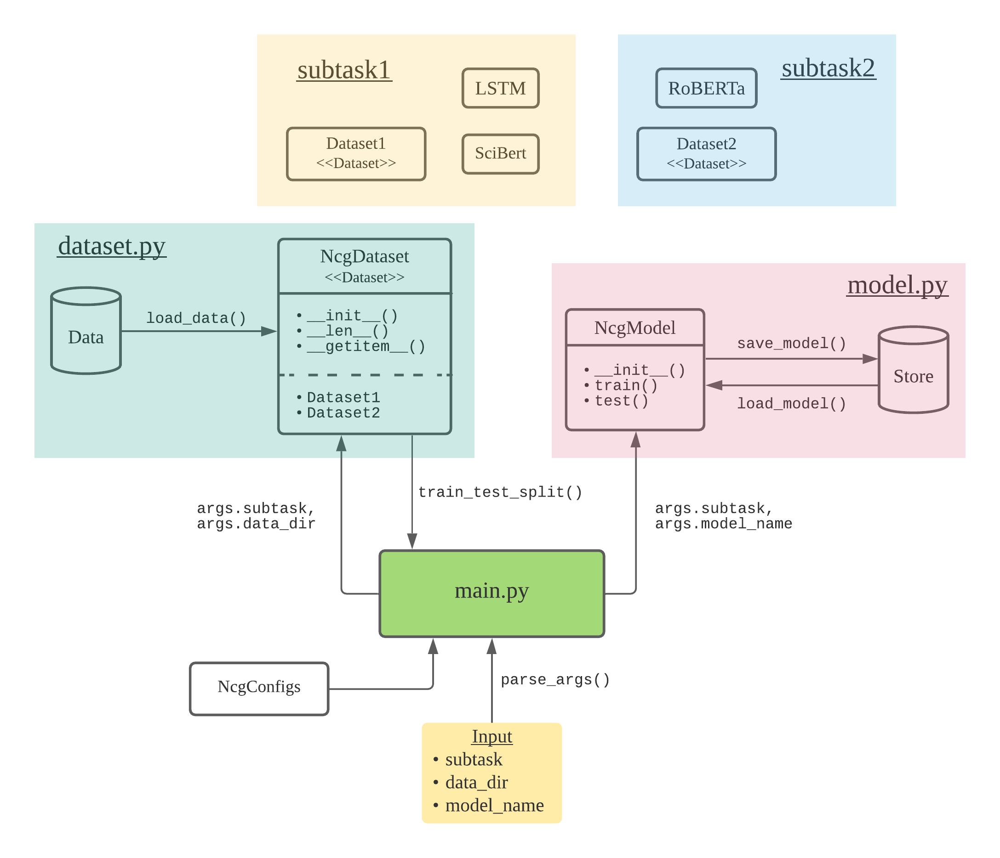

# CS4248 G17 NLP Project

## About

### Task Background (Information Extraction)

The [SemEval-2021 Shared Task NLP CONTRIBUTION GRAPH](https://competitions.codalab.org/competitions/25680) (a.k.a. ‘the NCG task’) tasks participants to develop
automated systems that structure contributions from NLP scholarly articles in English.

### Subtask 1

**Input:** a research article in plaintext format \
**Output:** a set of contributing sentences

### Subtask 2

**Input:** a contributing sentence \
**Output:** a set of scientific knowledge terms and predicate phrases

## Guide

### Dependencies

- [Python 3.8 or 3.9](https://www.python.org/downloads/)
- [PyTorch](https://pytorch.org/get-started/locally/)

Additionally, install other dependencies in `requirements.txt` using `conda` or `pip`

### How To Run

1. Make sure you have installed all the dependencies mentioned above
2. Clone or download this repository, then open a terminal and navigate to this folder
3. Train, test & evaluate the model by running `python3 main.py {config}` which:
   1. Select the `config`-th configurations from `config.py`. Enter `python3 main.py 0`
      to see all available configurations.
   2. Load all data from the `data/` folder
   3. Randomly split the dataset into training & testing set
   4. Train the model using the training set and store the model in the `model` file
   5. Test the model against the testing set

### Useful flags

These optional flags can be combined into one single command line:

- Use `-d [data_dir/]` to specify which dataset folder to use, default: `data/`
- Use `-m [model_name]` to specify the model filename to generate, default: `model/`
- Use `-s [summary_name]` to specify the summary name, default will be auto-generated by `wandb`
- Use `--summary` to enable summary mode
- Use `--train` to train model only
- Use `--test` to test model only

#### Examples

`python3 main.py 1`

`python3 main.py 1 -d data-small/ --summary -s scibert`

`python3 main.py 2 --train`

## Project Structure

### General

- `main.py` - main runner file of the project
- `dataset.py` - loads, pre-processes data and implements the `NcgDataset` class
- `model.py` - loads, saves model and implements the `NcgModel` class
- `config.py` - defines all hyperparameters
- `subtask1/` - implements the dataset, models and helper functions for subtask 1
- `subtask2/` - implements the dataset, models and helper functions for subtask 2
- `documentation/` - written reports

### Data

- `data/` - contains 38 task folders
- `data-small/` - a subset of `data/`, contains 5 task folders
- `data-one/` - a subset of `data/`, contains 1 task folder

The data folders is organized as follows:

    [task-name-folder]/                                # natural_language_inference, paraphrase_generation, question_answering, relation_extraction, etc
        ├── [article-counter-folder]/                  # ranges between 0 to 100 since we annotated varying numbers of articles per task
        │   ├── [article-name].pdf                     # scholarly article pdf
        │   ├── [article-name]-Grobid-out.txt          # plaintext output from the [Grobid parser](https://github.com/kermitt2/grobid)
        │   ├── [article-name]-Stanza-out.txt          # plaintext preprocessed output from [Stanza](https://github.com/stanfordnlp/stanza)
        │   ├── sentences.txt                          # annotated Contribution sentences in the file
        │   ├── entities.txt                           # annotated entities in the Contribution sentences
        │   └── info-units/                            # the folder containing information units in JSON format
        │   │   └── research-problem.json              # `research problem` mandatory information unit in json format
        │   │   └── model.json                         # `model` information unit in json format; in some articles it is called `approach`
        │   │   └── ...                                # there are 12 information units in all and each article may be annotated by 3 or 6
        │   └── triples/                               # the folder containing information unit triples one per line
        │   │   └── research-problem.txt               # `research problem` triples (one research problem statement per line)
        │   │   └── model.txt                          # `model` triples (one statement per line)
        │   │   └── ...                                # there are 12 information units in all and each article may be annotated by 3 or 6
        │   └── ...                                    # there are K articles annotated for each task, so this repeats for the remaining K-1 annotated articles
        └── ...                                        # if there are N task folders overall, then this repeats N-1 more times

## Resources

### Official Links

[Official Website](https://ncg-task.github.io/)

[CodaLab Portal](https://competitions.codalab.org/competitions/25680)

NCG Task [Paper](https://arxiv.org/pdf/2106.07385.pdf) [GitHub](https://github.com/ncg-task?tab=repositories)

[Evaluation script](https://github.com/ncg-task/scoring-program/blob/master/evaluation.py)

### Participating Teams

1. ITNLP [Paper](https://aclanthology.org/2021.semeval-1.59.pdf) [GitHub](https://github.com/itnlp606/nlpcb-graph)

2. UIUC_BioNLP [Paper](https://arxiv.org/pdf/2105.05435.pdf) [GitHub](https://github.com/Liu-Hy/nlp-contrib-graph)

3. IITK [Paper](https://arxiv.org/pdf/2104.01619.pdf) [GitHub](https://github.com/sshailabh/SemEval-2021-Task-11)

4. ECNUICA [Paper](https://aclanthology.org/2021.semeval-1.185.pdf)

5. INNOVATORS [Paper](https://aclanthology.org/2021.semeval-1.61.pdf) [GitHub](https://github.com/HardikArora17/)

6. Duluth [Paper](https://aclanthology.org/2021.semeval-1.60.pdf) [GitHub](https://github.com/anmartin94/DuluthSemEval2021Task11)

7. YNU-HPCC [Paper](https://aclanthology.org/2021.semeval-1.58.pdf) [GitHub](https://github.com/maxinge8698/SemEval2021-Task11)
